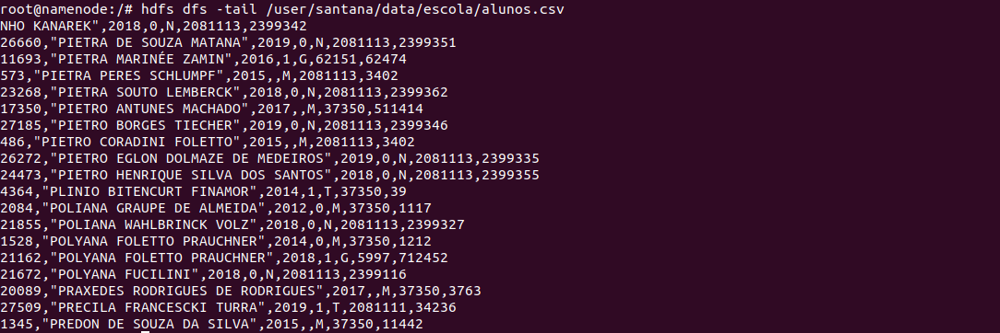
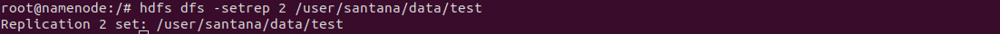

# Armazenamento de Dados com Apache Hadoop 3.3.1 HDFS


Este artigo foi inspirado no conteúdo do curso de Engenharia de Dados, módulo Big Data Foundations na Semantix Academy e documentação do projeto Apache Hadoop 3.


# Apache Hadoop


O projeto Apache™ Hadoop® desenvolve software de código aberto para computação distribuída confiável, escalável.
A biblioteca de software Apache Hadoop é uma estrutura que permite o processamento distribuído de grandes conjuntos de dados em clusters de computadores usando modelos de programação simples. Ele foi projetado para escalar de servidores únicos para milhares de máquinas, cada uma oferecendo computação e armazenamento locais. Em vez de depender de hardware para fornecer alta disponibilidade, a própria biblioteca foi projetada para detectar e lidar com falhas na camada de aplicação, fornecendo um serviço altamente disponível em um cluster de computadores, cada um dos quais pode estar propenso a falhas.


# HDFS


O Hadoop Distributed File System (HDFS) é um sistema de arquivos distribuído projetado para ser executado em hardware comum. Ele tem muitas semelhanças com os sistemas de arquivos distribuídos existentes. No entanto, as diferenças de outros sistemas de arquivos distribuídos são significativas. O HDFS é altamente tolerante a falhas e foi projetado para ser implantado em hardware de baixo custo. O HDFS fornece acesso de alta taxa de transferência aos dados do aplicativo e é adequado para aplicativos que possuem grandes conjuntos de dados. O HDFS relaxa alguns requisitos POSIX para permitir o acesso de streaming aos dados do sistema de arquivos. O HDFS foi originalmente construído como infraestrutura para o projeto de mecanismo de pesquisa da Web Apache Nutch. O HDFS faz parte do projeto Apache Hadoop Core.

(Projeto: [http://hadoop.apache.org/](http://hadoop.apache.org/))


### Falha de hardware


O HDFS foi projetado considerando que a falha de hardware vai acontecer. Portanto, a detecção de falhas e a recuperação rápida e automática delas é um objetivo arquitetural central do HDFS.


### Acesso a dados de streaming


O HDFS foi projetado considerando principalmente o processamento dos dados em lote.


### Grandes conjuntos de dados


O HDFS é ajustado para suportar grandes volumes de dados e escalar para centenas de nós em um único cluster. Deve suportar dezenas de milhões de arquivos em uma única instância.


### Acesso leitura e gração dos arquivos


O HDFS pode ser usado como parte da estratégia em um "Data Lake", mas é interessante considerar que o conteúdo gravado esteja em formato imutável. Essa suposição simplifica os problemas de coerência de dados e permite o acesso a dados de alto rendimento. 


### Movimentação dos dados


O HDFS fornece interfaces para otimizar o acesso aos dados pelos os aplicativos.


### Portabilidade entre plataformas heterogêneas de hardware e software 


O HDFS foi projetado para ser facilmente portátil de uma plataforma para outra. Isso facilita a ampla adoção do HDFS como plataforma de escolha para um grande conjunto de aplicativos. 


### NameNode e DataNodes


O HDFS tem uma arquitetura mestre/escravo. Um cluster HDFS consiste em um único NameNode, um servidor mestre que gerencia o namespace do sistema de arquivos e regula o acesso aos arquivos pelos clientes. Além disso, há vários DataNodes, geralmente um por nó no cluster, que gerenciam o armazenamento anexado aos nós em que são executados. O HDFS expõe um namespace do sistema de arquivos e permite que os dados do usuário sejam armazenados em arquivos. Internamente, um arquivo é dividido em um ou mais blocos e esses blocos são armazenados em um conjunto de DataNodes. O NameNode executa operações de namespace do sistema de arquivos, como abrir, fechar e renomear arquivos e diretórios. Também determina o mapeamento de blocos para DataNodes. Os DataNodes são responsáveis ​​por atender as solicitações de leitura e gravação dos clientes do sistema de arquivos. Os DataNodes também executam a criação, exclusão e replicação de blocos mediante instrução do NameNode. 


O NameNode e o DataNode são softwares projetados para serem executados em máquinas comuns. Essas máquinas normalmente executam um sistema operacional (SO) GNU/Linux. O HDFS é construído usando a linguagem Java; qualquer máquina que suporte Java pode executar o software NameNode ou DataNode. O uso da linguagem Java altamente portátil significa que o HDFS pode ser implementado em uma ampla variedade de máquinas. Uma implantação típica tem uma máquina dedicada que executa apenas o software NameNode. Cada uma das outras máquinas no cluster executa uma instância do software DataNode. A arquitetura não impede a execução de vários DataNodes na mesma máquina, mas em uma implantação real que raramente é o caso.

A existência de um único NameNode em um cluster simplifica muito a arquitetura do sistema. O NameNode é o árbitro e o repositório de todos os metadados do HDFS. O sistema é projetado de forma que os dados do usuário nunca fluam pelo NameNode. 


### O namespace do sistema de arquivos


O HDFS suporta uma organização de arquivos hierárquica tradicional. Um usuário ou um aplicativo pode criar diretórios e armazenar arquivos dentro desses diretórios. A hierarquia do namespace do sistema de arquivos é semelhante à maioria dos outros sistemas de arquivos existentes; pode-se criar e remover arquivos, mover um arquivo de um diretório para outro ou renomear um arquivo. O HDFS oferece suporte a cotas de usuários e permissões de acesso . O HDFS não oferece suporte a links físicos ou links flexíveis. No entanto, a arquitetura HDFS não impede a implementação desses recursos.

Embora o HDFS siga a convenção de nomenclatura do FileSystem, alguns caminhos e nomes (por exemplo , /.reserved e .snapshot ) são reservados. Recursos como criptografia transparente e instantâneo usam caminhos reservados.

O NameNode mantém o namespace do sistema de arquivos. Qualquer alteração no namespace do sistema de arquivos ou em suas propriedades é registrada pelo NameNode. Um aplicativo pode especificar o número de réplicas de um arquivo que deve ser mantido pelo HDFS. O número de cópias de um arquivo é chamado de fator de replicação desse arquivo. Essas informações são armazenadas pelo NameNode.


### Replicação de dados


O HDFS foi projetado para armazenar de forma confiável arquivos muito grandes em máquinas em um grande cluster. Ele armazena cada arquivo como uma sequência de blocos. Os blocos de um arquivo são replicados para tolerância a falhas. O tamanho do bloco e o fator de replicação são configuráveis ​​por arquivo.

Todos os blocos em um arquivo, exceto o último bloco, são do mesmo tamanho, enquanto os usuários podem iniciar um novo bloco sem preencher o último bloco com o tamanho de bloco configurado após o suporte para bloco de comprimento variável ter sido adicionado para anexar e hsync.

Um aplicativo pode especificar o número de réplicas de um arquivo. O fator de replicação pode ser especificado no momento da criação do arquivo e pode ser alterado posteriormente. Os arquivos no HDFS são de gravação única (exceto para acréscimos e truncamentos) e possuem estritamente um gravador por vez.

O NameNode toma todas as decisões relativas à replicação de blocos. Ele recebe periodicamente um Heartbeat e um Blockreport de cada um dos DataNodes no cluster. O recebimento de um Heartbeat implica que o DataNode está funcionando corretamente. Um Blockreport contém uma lista de todos os blocos em um DataNode.


### Blocos de dados


O HDFS foi projetado para suportar arquivos muito grandes. Os aplicativos compatíveis com HDFS são aqueles que lidam com grandes conjuntos de dados. Esses aplicativos gravam seus dados apenas uma vez, mas os leem uma ou mais vezes e exigem que essas leituras sejam satisfeitas em velocidades de streaming. Um tamanho de bloco típico usado pelo HDFS é 128 MB. Assim, um arquivo HDFS é dividido em pedaços de 128 MB e, se possível, cada pedaço residirá em um DataNode diferente.


### Distribuição das Réplicas


O posicionamento das réplicas é fundamental para a confiabilidade e o desempenho do HDFS. A otimização do posicionamento da réplica diferencia o HDFS da maioria dos outros sistemas de arquivos distribuídos. Este é um recurso que precisa de muito ajuste e experiência. A finalidade de uma política de posicionamento de réplica com reconhecimento de rack é melhorar a confiabilidade, a disponibilidade e a utilização da largura de banda da rede. A implementação atual da política de posicionamento de réplicas é um primeiro esforço nessa direção. Os objetivos de curto prazo da implementação dessa política são validá-la em sistemas de produção, aprender mais sobre seu comportamento e construir uma base para testar e pesquisar políticas mais sofisticadas.

Grandes instâncias HDFS são executadas em um cluster de computadores que geralmente se espalham por vários racks. A comunicação entre dois nós em racks diferentes deve passar por switches. Na maioria dos casos, a largura de banda de rede entre máquinas no mesmo rack é maior que a largura de banda de rede entre máquinas em racks diferentes.

O NameNode determina o ID do rack ao qual cada DataNode pertence por meio do processo descrito no Hadoop Rack Awareness . Uma política simples, mas não ideal, é colocar réplicas em racks exclusivos. Isso evita a perda de dados quando um rack inteiro falha e permite o uso de largura de banda de vários racks ao ler dados. Essa política distribui réplicas uniformemente no cluster, o que facilita o balanceamento de carga em caso de falha de componente. No entanto, essa política aumenta o custo das gravações porque uma gravação precisa transferir blocos para vários racks.

Para o caso comum, quando o fator de replicação é três, a política de posicionamento do HDFS é colocar uma réplica na máquina local se o gravador estiver em um datanode, caso contrário, em um datanode aleatório no mesmo rack do gravador, outra réplica no um nó em um rack diferente (remoto) e o último em um nó diferente no mesmo rack remoto. Essa política corta o tráfego de gravação entre racks, o que geralmente melhora o desempenho de gravação. A chance de falha do rack é muito menor do que a falha do nó; esta política não afeta a confiabilidade dos dados e as garantias de disponibilidade. No entanto, não reduz a largura de banda de rede agregada usada na leitura de dados, pois um bloco é colocado em apenas dois racks exclusivos, em vez de três. Com essa política, as réplicas de um bloco não são distribuídas uniformemente pelos racks. Duas réplicas estão em nós diferentes de um rack e a réplica restante está em um nó de um dos outros racks. Essa política melhora o desempenho de gravação sem comprometer a confiabilidade dos dados ou o desempenho de leitura.

Se o fator de replicação for maior que 3, o posicionamento da 4ª réplica e seguintes são determinados aleatoriamente, mantendo o número de réplicas por rack abaixo do limite superior (que é basicamente (réplicas - 1) / racks + 2 ).

Como o NameNode não permite que os DataNodes tenham várias réplicas do mesmo bloco, o número máximo de réplicas criadas é o número total de DataNodes naquele momento.

Depois que o suporte para tipos de armazenamento e políticas de armazenamento foi adicionado ao HDFS, o NameNode leva a política em consideração para o posicionamento da réplica, além do reconhecimento de rack descrito acima. O NameNode escolhe os nós com base no reconhecimento do rack primeiro e, em seguida, verifica se o nó candidato tem armazenamento exigido pela política associada ao arquivo. Se o nó candidato não tiver o tipo de armazenamento, o NameNode procurará outro nó. Se nós suficientes para colocar réplicas não puderem ser encontrados no primeiro caminho, o NameNode procurará nós com tipos de armazenamento de fallback no segundo caminho.

A política de posicionamento de réplica padrão atual descrita aqui é um trabalho em andamento.


### Seleção de réplica


Para minimizar o consumo de largura de banda global e a latência de leitura, o HDFS tenta atender a uma solicitação de leitura de uma réplica mais próxima do leitor. Se houver uma réplica no mesmo rack que o nó do leitor, essa réplica será preferida para atender à solicitação de leitura. Se o cluster HDFS abranger vários datacenters, uma réplica residente no datacenter local terá preferência sobre qualquer réplica remota.


### Bloquear políticas de veiculação


Conforme mencionado acima, quando o fator de replicação é três, a política de posicionamento do HDFS é colocar uma réplica na máquina local se o gravador estiver em um datanode, caso contrário, em um datanode aleatório no mesmo rack do gravador, outra réplica em um nó em um rack diferente (remoto) e o último em um nó diferente no mesmo rack remoto. Se o fator de replicação for maior que 3, o posicionamento da 4ª réplica e seguintes são determinados aleatoriamente, mantendo o número de réplicas por rack abaixo do limite superior (que é basicamente (réplicas - 1) / racks + 2). Além disso, o HDFS suporta 4 Políticas de Colocação de Blocos conectáveis ​​diferentes . Os usuários podem escolher a política com base em sua infraestrutura e caso de uso. Por padrão, o HDFS suporta BlockPlacementPolicyDefault.


### Modo de segurança


Na inicialização, o NameNode entra em um estado especial chamado Safemode. A replicação de blocos de dados não ocorre quando o NameNode está no estado Safemode. O NameNode recebe mensagens Heartbeat e Blockreport dos DataNodes. Um Blockreport contém a lista de blocos de dados que um DataNode está hospedando. Cada bloco tem um número mínimo especificado de réplicas. Um bloco é considerado replicado com segurança quando o número mínimo de réplicas desse bloco de dados fez check-in com o NameNode. Após uma porcentagem configurável de blocos de dados replicados com segurança fazer check-in com o NameNode (mais 30 segundos adicionais), o NameNode sai do estado Safemode. Em seguida, determina a lista de blocos de dados (se houver) que ainda têm menos do que o número especificado de réplicas. O NameNode então replica esses blocos para outros DataNodes.


### A persistência dos metadados do sistema de arquivos


O namespace HDFS é armazenado pelo NameNode. O NameNode usa um log de transações chamado EditLog para registrar persistentemente todas as alterações que ocorrem nos metadados do sistema de arquivos. Por exemplo, criar um novo arquivo no HDFS faz com que o NameNode insira um registro no EditLog indicando isso. Da mesma forma, alterar o fator de replicação de um arquivo faz com que um novo registro seja inserido no EditLog. O NameNode usa um arquivo em seu sistema de arquivos do sistema operacional do host local para armazenar o EditLog. Todo o namespace do sistema de arquivos, incluindo o mapeamento de blocos para arquivos e propriedades do sistema de arquivos, é armazenado em um arquivo chamado FsImage. O FsImage também é armazenado como um arquivo no sistema de arquivos local do NameNode.

O NameNode mantém uma imagem de todo o namespace do sistema de arquivos e do arquivo Blockmap na memória. Quando o NameNode é inicializado ou um ponto de verificação é acionado por um limite configurável, ele lê o FsImage e o EditLog do disco, aplica todas as transações do EditLog à representação na memória do FsImage e libera essa nova versão em um novo FsImage no disco. Ele pode então truncar o EditLog antigo porque suas transações foram aplicadas ao FsImage persistente. Esse processo é chamado de ponto de verificação. O objetivo de um ponto de verificação é garantir que o HDFS tenha uma visão consistente dos metadados do sistema de arquivos, tirando um instantâneo dos metadados do sistema de arquivos e salvando-o em FsImage. Embora seja eficiente ler um FsImage, não é eficiente fazer edições incrementais diretamente em um FsImage. Em vez de modificar FsImage para cada edição, persistimos as edições no Editlog. Durante o ponto de verificação, as alterações do Editlog são aplicadas ao FsImage. Um ponto de verificação pode ser acionado em um determinado intervalo de tempo (dfs.namenode.checkpoint.period ) expresso em segundos, ou após um determinado número de transações do sistema de arquivos se acumularem ( dfs.namenode.checkpoint.txns ). Se ambas as propriedades estiverem configuradas, o primeiro limite a ser atingido acionará um ponto de verificação.

O DataNode armazena dados HDFS em arquivos em seu sistema de arquivos local. O DataNode não tem conhecimento sobre arquivos HDFS. Ele armazena cada bloco de dados HDFS em um arquivo separado em seu sistema de arquivos local. O DataNode não cria todos os arquivos no mesmo diretório. Em vez disso, ele usa uma heurística para determinar o número ideal de arquivos por diretório e cria subdiretórios adequadamente. Não é ideal criar todos os arquivos locais no mesmo diretório porque o sistema de arquivos local pode não ser capaz de suportar com eficiência um grande número de arquivos em um único diretório. Quando um DataNode é inicializado, ele verifica seu sistema de arquivos local, gera uma lista de todos os blocos de dados HDFS que correspondem a cada um desses arquivos locais e envia esse relatório para o NameNode. O relatório é chamado de Blockreport .


### Os protocolos de comunicação


Todos os protocolos de comunicação HDFS são sobrepostos ao protocolo TCP/IP. Um cliente estabelece uma conexão com uma porta TCP configurável na máquina NameNode. Ele fala o ClientProtocol com o NameNode. Os DataNodes conversam com o NameNode usando o protocolo DataNode. Uma abstração de chamada de procedimento remoto (RPC) envolve o protocolo do cliente e o protocolo do DataNode. Por design, o NameNode nunca inicia nenhum RPC. Em vez disso, ele responde apenas a solicitações RPC emitidas por DataNodes ou clientes.


### Robustez


O objetivo principal do HDFS é armazenar dados de forma confiável mesmo na presença de falhas. Os três tipos comuns de falhas são falhas de NameNode, falhas de DataNode e partições de rede.


### Falha no disco de dados, disponibilidadee replicação


Cada DataNode envia uma mensagem Heartbeat para o NameNode periodicamente. Uma partição de rede pode fazer com que um subconjunto de DataNodes perca a conectividade com o NameNode. O NameNode detecta essa condição pela ausência de uma mensagem Heartbeat. O NameNode marca DataNodes sem Heartbeats recentes como mortos e não encaminha novas solicitações de IO para eles. Quaisquer dados que foram registrados em um DataNode morto não estão mais disponíveis para o HDFS. A morte do DataNode pode fazer com que o fator de replicação de alguns blocos fique abaixo do valor especificado. O NameNode rastreia constantemente quais blocos precisam ser replicados e inicia a replicação sempre que necessário. A necessidade de replicação pode surgir devido a vários motivos: um DataNode pode ficar indisponível, uma réplica pode ficar corrompida, um disco rígido em um DataNode pode falhar,

O tempo limite para marcar DataNodes morto é conservadoramente longo (mais de 10 minutos por padrão) para evitar a sobrecarga de replicação causada pela oscilação de estado de DataNodes. Os usuários podem definir um intervalo mais curto para marcar DataNodes como obsoletos e evitar nós obsoletos na leitura e/ou gravação por configuração para cargas de trabalho sensíveis ao desempenho.


### Rebalanceamento de cluster


A arquitetura HDFS é compatível com esquemas de rebalanceamento de dados. Um esquema pode mover dados automaticamente de um DataNode para outro se o espaço livre em um DataNode ficar abaixo de um determinado limite. No caso de uma alta demanda repentina por um arquivo específico, um esquema pode criar dinamicamente réplicas adicionais e reequilibrar outros dados no cluster. Esses tipos de esquemas de rebalanceamento de dados ainda não foram implementados.


### Integridade de dados


É possível que um bloco de dados obtido de um DataNode chegue corrompido. Essa corrupção pode ocorrer devido a falhas em um dispositivo de armazenamento, falhas de rede ou software com bugs. O software cliente HDFS implementa a verificação de soma de verificação no conteúdo dos arquivos HDFS. Quando um cliente cria um arquivo HDFS, ele calcula uma soma de verificação de cada bloco do arquivo e armazena essas somas de verificação em um arquivo oculto separado no mesmo namespace HDFS. Quando um cliente recupera o conteúdo do arquivo, ele verifica se os dados recebidos de cada DataNode correspondem à soma de verificação armazenada no arquivo de soma de verificação associado. Caso contrário, o cliente pode optar por recuperar esse bloco de outro DataNode que tenha uma réplica desse bloco.


### Falha no disco de metadados


O FsImage e o EditLog são estruturas de dados centrais do HDFS. A corrupção desses arquivos pode fazer com que a instância do HDFS não funcione. Por esse motivo, o NameNode pode ser configurado para dar suporte à manutenção de várias cópias do FsImage e do EditLog. Qualquer atualização para o FsImage ou EditLog faz com que cada um dos FsImages e EditLogs seja atualizado de forma síncrona. Essa atualização síncrona de várias cópias do FsImage e EditLog pode degradar a taxa de transações de namespace por segundo que um NameNode pode suportar. No entanto, essa degradação é aceitável porque, embora os aplicativos HDFS sejam de natureza muito intensiva em dados, eles não são intensivos em metadados. Quando um NameNode é reiniciado, ele seleciona o FsImage e o EditLog consistentes mais recentes a serem usados.

Outra opção para aumentar a resiliência contra falhas é habilitar a alta disponibilidade usando vários NameNodes com um armazenamento compartilhado no NFS ou usando um log de edição distribuído (chamado Journal). Esta última é a abordagem recomendada.


### Cópia de um instante (retrato) 


Os "snapshots" (retratos de um instante) suportam o armazenamento de uma cópia de dados em um determinado instante de tempo. Um uso do recurso de snapshots pode ser reverter uma instância HDFS corrompida para um ponto no tempo previamente conhecido.


### Pipeline de replicação


Quando um cliente está gravando dados em um arquivo HDFS com um fator de replicação de três, o NameNode recupera uma lista de DataNodes usando um algoritmo de escolha de destino de replicação. Essa lista contém os DataNodes que hospedarão uma réplica desse bloco. O cliente então grava no primeiro DataNode. O primeiro DataNode começa a receber os dados em partes, grava cada parte em seu repositório local e transfere essa parte para o segundo DataNode na lista. O segundo DataNode, por sua vez, começa a receber cada parte do bloco de dados, grava essa parte em seu repositório e, em seguida, libera essa parte para o terceiro DataNode. Finalmente, o terceiro DataNode grava os dados em seu repositório local. Assim, um DataNode pode estar recebendo dados do anterior no pipeline e ao mesmo tempo encaminhando dados para o próximo no pipeline.


### Acessibilidade


O HDFS pode ser acessado de aplicativos de muitas maneiras diferentes. Nativamente, o HDFS fornece uma API Java do FileSystem para os aplicativos usarem. Um wrapper de linguagem C para essa API Java e API REST também está disponível. Além disso, um navegador HTTP e também pode ser usado para navegar pelos arquivos de uma instância do HDFS. Ao usar o gateway NFS , o HDFS pode ser montado como parte do sistema de arquivos local do cliente.


### FS Shell


O HDFS permite que os dados do usuário sejam organizados na forma de arquivos e diretórios. Ele fornece uma interface de linha de comando chamada shell FS que permite que um usuário interaja com os dados no HDFS. A sintaxe deste conjunto de comandos é semelhante a outros shells (por exemplo, bash, csh) com os quais os usuários já estão familiarizados. O shell FS é direcionado para aplicativos que precisam de uma linguagem de script para interagir com os dados armazenados.


### Exemplos de operações simples 

<!-- #region -->
Para executar os próximos exemplos, você precisa baixar e instalar alguns "contâniners" docker em sua máquina. Estou estudando a partir de um cluster de Big Data disponibilizado no curso de Engenharia de Dados na Semantix Academy.

#### Baixar o conteúdo do Cluster
```Python
$ git clone https://github.com/rodrigo-reboucas/docker-bigdata.git
``` 

#### Resultado:


#### Baixar as Imagens do Cluster
```Python
$ docker-compose pull
``` 
#### Resultado:


#### Executar os containers
```Python
$ docker-compose up –d
```
#### Resultado:


#### Listar o contâiner NameNode, o qual iremos trabalhar
```Python
$ docker ps | grep "namenode"
``` 
#### Resultado:

<!-- #endregion -->

#### Comandos HDFS

1. Acessar o shell do contâiner NameNode

```Python
$ docker exec -it namenode bash
```

#### Resultado:


2. Criar a estrutura de pastas com seguintes nomes: data, recover e delete.

```Python
$ hdfs dfs -mkdir -p /user/santana/data
$ hdfs dfs -mkdir -p /user/santana/recover
$ hdfs dfs -mkdir -p /user/santana/delete

```
3. Listar a estrutura de pastas.

#### Resultado:


4. Enviar a pasta “/input/exercises-data/escola” e o arquivo “/input/exercises-data/entrada1.txt” para data


Note que: a pasta “/input/exercises-data/escola” está na sua máquina local e o diretório **data** está na estrutura de arquivos do Hadoop HDFS.


```Python
$ hdfs dfs -put /input/exercises-data/escola/ /user/santana/data
$ hdfs dfs -put /input/exercises-data/entrada1.txt /user/santana/data
```
#### Resultado:


5. Mover o arquivo “entrada1.txt” para recover

```Python
$ hdfs dfs -mv /user/santana/data/entrada1.txt /user/santana/recover
```

#### Resultado:


6. Baixar o arquivo do hdfs “escola/alunos.json” para o sistema local /

```Python
$ hdfs dfs -get /user/santana/data/escola/alunos.json /diretorio_local/alunos.json
```

#### Resultado:


7. Apagar a pasta recover (no HDFS)

```Python
$ hdfs dfs -rm -R /user/santana/recover
```

#### Resultado:


**ATENÇÃO: Quando as operações envolverem ações que vão apagar ou mover conjunto de dados, tome sempre cuidado especial.**


8. Deletar permanentemente o diretório delete (no HDFS)

```Python
$ hdfs dfs -rm -R -skipTrash /user/santana/delete
```

#### Resultado:


9. Procurar o arquivo “alunos.csv” dentro do /user

```Python
$ hdfs dfs -find /user/ -name \alunos.csv
```

#### Resultado:


10. Mostrar o último 1KB do arquivo “alunos.csv”

```Python
$ hdfs dfs -tail /user/santana/data/escola/alunos.csv
```

#### Resultado:



11. Mostrar as 2 primeiras linhas do arquivo “alunos.csv”

```Python
$ hdfs dfs -cat /user/santana/data/escola/alunos.csv | head -n 2
```

#### Resultado:


12. Verificação de soma das informações do arquivo “alunos.csv”

```Python
$ hdfs dfs -checksum /user/santana/data/escola/alunos.csv
```

#### Resultado:


13. Criar um arquivo em branco com o nome de “test” no data 

```Python
$ hdfs dfs -touchz /user/santana/data/test
```

#### Resultado:


### Diminuir o fator de replicação


Quando o fator de replicação de um arquivo é reduzido, o NameNode seleciona réplicas em excesso que podem ser excluídas. O próximo Heartbeat transfere essas informações para o DataNode. O DataNode então remove os blocos correspondentes e o espaço livre correspondente aparece no cluster. Mais uma vez, pode haver um atraso entre a conclusão da chamada da API setReplication e o aparecimento de espaço livre no cluster.


14. Alterar o fator de replicação do arquivo “test” para 2

```Python
$ hdfs dfs -setrep 2 /user/santana/data/test
```

#### Resultado:



15. Ver as informações do arquivo “alunos.csv”

```Python
$ hdfs dfs -stat %n /user/santana/data/test
$ hdfs dfs -stat %o /user/santana/data/test
$ hdfs dfs -stat %r /user/santana/data/test
$ hdfs dfs -stat %u /user/santana/data/test

```

#### Resultado:


16. Exibir o espaço livre do data (no HDFS) e o uso do disco

```Python
$ hdfs dfs -df -h
$ hdfs dfs -du -h /user

```

#### Resultado:


Pronto!

Chegou o final da jornada exploratória para conhecermos um pouquinho o Apache Hadoop HDFS, tem muito mais comandos e funcionalidades que não foram exploradas aqui, consulte a documentação de referência.

Espero ter contribuido com o seu desenvolvimento de alguma forma.

[Carlos Eugênio](https://github.com/carlosemsantana)


### Referência:


* [https://academy.semantix.com.br](https://academy.semantix.com.br)
* [https://hadoop.apache.org/docs/r3.3.1/](https://hadoop.apache.org/docs/r3.3.1/)
* [https://hadoop.apache.org/docs/r3.3.1/hadoop-project-dist/hadoop-hdfs/HdfsDesign.html](https://hadoop.apache.org/docs/r3.3.1/hadoop-project-dist/hadoop-hdfs/HdfsDesign.html)
